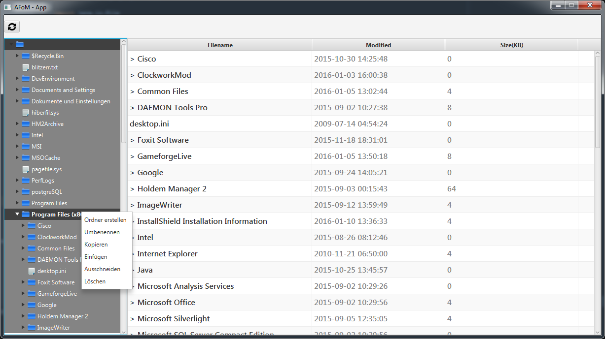

# fhj.swengb.project.AFoM

###Final SWENGB Project; Filebrowser AFoM

The members of the developer team are:
- Hoxha Granit
- Steinkellner Wolfgang
- Hysi Steven

This project models a filebrowser like the one you know from Windows, MacOS or Linux best as possible.

##implemented functions:
- listing of all files in the right structure

- Drag&Drop for file/directory moving, incl. opening directory at hovering

- preview for:
            - picture
            - textfile
            - files in directory:
                            - name
                            - last modified
                            - size

- options available via context menu:
            - copy
            - paste
            - cut
            - rename

- opening files with standard program

This project was developed as part of our software development course

